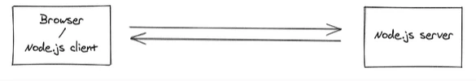

# Deploying Socket.IO to Azure Web App

Building applications in today’s world requires real-time web functionality to applications. This used to be considered an extra, a nice to have, but in todays development world it is now considered required. So what is a real-time web functionality? The most common example is a real-time chat application. But it is so much more and much deeper in todays web environment. On a given day, you most likely interact with dozens of websites and I would wager the vast majority of them have some element of real-time communications. For example, Facebook and Twitter has real-time notifications in the browser. Your news websites might give you alerts on breaking news.

In the old days, the website might have been configured with a timer and simply refreshed every 60 seconds. This worked but created a lot of unnecessary noise between the client and the server. Enter real-time, bidirectional and event-based communication between the browser and the server.



There are several products that do this. The largest is Socket.IO. It’s been around for a while. It is open sourced and used by companies around the world – including Microsoft. Parts of Microsoft Office online and Yammer both continue to use Socket.IO today. That does not mean that they are the only player in this space. There are several companies who offer this service as either a paid/hosted service or through open-source libraries: including Microsoft that offers SignalR.

You might ask, why Socket.IO if SignalR is available? For me it was ease of deployment and online documentation. There is something to be said about a product that is used by millions of websites. A simple search of Socket.IO on Stack Overflow and you can see hundreds of code samples.

In this guide we are going to deploy Socket.IO into Azure as a NodeJS application. And in addition, we will take the sample chat application from Socket.IO website and show a few things that are possible.

## Get Everything Ready
For this project I will be using VS Code, Node.js and NPM. If you haven’t already, you should install these items to your workstation before we get going. You need at least Node.js 10 or later.

From your workstation, create a new directory. Mine is called SocketIO. Launch VS Code and choose File | Open Folder and browse to your newly created folder.

Once VS Code is open, choose Terminal | New Terminal and run:

```javascript
npm init
```

It will ask you a bunch of basic questions about your application. Feel free to answer these however you like. No decision here will break anything.

Next, we need to install Socket.IO, run:
```javascript
npm install socket.io
```

Next, we are going to install Express as the server Socket.IO will run under, run:
```javascript
npm install socket.io
```

We now have all of the needed parts to build our Express Server running Socket.IO. In our VS Code environment, we should add one other file since we will publish this to GitHub.

Create a file named .gitnore and add two items:

```txt
node_modles
.vscode
```

## Building the Socket.IO Server
Now we need to setup our web server and integrate Socket.IO into Express. To do that, from VS Code, create a file named index.js at the root of the project. You are going to add this to the file:

```javascript
const express = require('express');
const app = express();
const server = require('http').createServer((req, res) => res.end());
const io = require('socket.io')(server, {
    perMessageDeflate :false,
    cors: {
        origin: '*',
        methods: ['GET', 'POST'],
    },
});

io.on('connection', (socket) => {
    console.log('a user connected');
    socket.on('disconnect', () => {
        console.log('user disconnected');
    });

    socket.on('chat message', (msg) => {
        io.emit('chat message', msg);
        console.log('message: ' + msg);
    });
});

server.listen(process.env.PORT || 3000, () => {
    console.log('listening on *:3000');
});
```

There are a lot of things happening here so let’s talk about the important items.

At the top we are declaring our variables (const). The first two are loading modules and creating our express app. The third is building our http server. The fourth is where we integrate Socket.IO into the Express server. There are two items we define:

perMessageDeflate is needed for Socket.IO to run in Azure. This is a requirement from Microsoft. Without it, it won’t work.
cors is to allow clients from any URL to connect. You could define the specific web url you want to allow to connect if you would rather.
NOTE: In almost ALL examples of Express and Socket.IO they assume your website is going to run in the same Express environment. That isn’t the real world in my mind. In most cases, you have a Socket.IO server and multiple clients connect to it from different locations.

The next section starting with io.on is where we wire up Socket.IO to do something. The first section tells us that when someone connects to the server, we are going to write a message to the console log. Next we have a disconnect event (i.e. when they close the tab) and in this case we are going to again display a message that the user disconnected. Lastly, we have a ‘chat message’ event. Here, we do two things.

io.emit will send this message to everyone who is subscribed to this Socket.IO server and listening for ‘chat message’. The second item, we will again write this out to the console.

The last three lines are the Express server starting up. Here we tell it we are going to run on port 3000 (locally) or on the process.env.PORT. When we deploy this to Azure, that will be 443.

We could run this locally now:

```bash
node index.js
```

We can now see it running:

## Our Chat Application Website
I mentioned this is an adaptation of the Socket.IO learn project. You can head over to that site to see the original steps if you want.

Unlike their project, we are going to build our chat application with the Web Server and Socket.IO server running in a different namespace. Again, I think this is much more realistic to what happens in the real-world.

For our website, we are going to create another project. First, we create a folder – I named mine ChatApp – and then you are going to open that folder within VS Code. A second instance of VS Code should be running now.

I want to really show that this “website” has no relationship to our previous project. So instead of using Express to run the website, I’m going to grab a VS Code extension called Live Server. Once Live Server is installed, you can click on “Go Live” from VS Code and it will start a local webserver for you on port 5500.

Inside of our ChatApp folder, create an index.html and add the following:

```html
<!DOCTYPE html>
<html>
    <head>
        <title>Socket.IO chat</title>

        <!-- JQuery -->
        <script
            src="https://code.jquery.com/jquery-1.12.4.js"
            integrity="sha256-Qw82+bXyGq6MydymqBxNPYTaUXXq7c8v3CwiYwLLNXU="
            crossorigin="anonymous"></script>

        <style>
            body { margin: 0; padding-bottom: 3rem; font-family: -apple-system, BlinkMacSystemFont, "Segoe UI", Roboto, Helvetica, Arial, sans-serif; }

            #mainBody { background: rgba(0, 0, 0, 0.15); padding: 0.25rem; position: fixed; bottom: 0; left: 0; right: 0; display: flex; height: 3rem; box-sizing: border-box; backdrop-filter: blur(10px); }
            #input { border: none; padding: 0 1rem; flex-grow: 1; border-radius: 2rem; margin: 0.25rem; }
            #input:focus { outline: none; }
            #form > button { background: #333; border: none; padding: 0 1rem; margin: 0.25rem; border-radius: 3px; outline: none; color: #fff; }

            #messages { list-style-type: none; margin: 0; padding: 0; }
            #messages > li { padding: 0.5rem 1rem; }
            #messages > li:nth-child(odd) { background: #efefef; }
        </style>
    </head>
    <body>
        <ul id="messages"></ul>
        <div id="mainBody" action="">
            <input id="input" autocomplete="off" />
            <button id="btnSend">Send</button>
        </div>

        <script src="https://cdn.socket.io/4.1.2/socket.io.min.js" integrity="sha384-toS6mmwu70G0fw54EGlWWeA4z3dyJ+dlXBtSURSKN4vyRFOcxd3Bzjj/AoOwY+Rg" crossorigin="anonymous"></script>
        <script>
            var socket = io.connect('http://localhost:3000');

            $(document.body).on('click', '#btnSend', () => {
                console.log('click button');
                socket.emit('chat message', input.value);
                input.value = '';
            });

            socket.on('chat message', function(msg) {
                console.log('received');
                $("#messages").append('<li>' + msg + '</li>');
            });
        </script>
    </body>
</html>
```
Lets talk about what we have above. The top is loading jQuery and some CSS. In the body of the HTML we have three items. First is a UL that we will append LI items to when messages are sent or received. You have the input text and a button to send your message.

In the script tag, we load Socket.IO from a CDN location. Below that, we create an instance of the socket and connect to our local server.

Below that we have our actions. First, is a click action for when the user clicks the btnSend button, we log the action to the browser console and emit it to the Socket.IO Server.

Directly below that, we have a socket.on function. When a ‘chat message’ event if received, we log the action and append the message to the UI we listed above creating a chat experience.

Remember, make sure to have your other project still running on port 3000.


## Deploy to Azure
We now have our working demo of a Chat Application. Now we want to deploy the Socket.IO portion to Azure.

Login to the Azure Portal and select Create A Resource


In the resulting page, search for Web App.


On the resulting page, you will select the options for your Web App. A few of these are very important. You can select any Subscription and Resource Group. Under the Runtime Stack, select Node 14 LTS. Ensure the operating system is Linux and select your desired region.


This step is critical! You need to select an App Service Plan to run this within. The F1 (Free) level DOES NOT support Web Sockets and your app will not work! So for this demo, I selected a Basic B2. Why not B1? I tried it at B1 and it failed. I deployed it at B2, it worked. I then was able to downgrade from B2 to B1 and it continued to work.

On the free tier you will get an error:

```txt
Error during WebSocket handshake: Unexpected response code: 503
```


You can now hit create and review. This will create your web app. But there are two more steps.

First, you need to enable Web Sockets on your App Service. From the Azure Console, navigate to Configuration and click on the General Settings tab. Make sure to enable Web Sockets.


Lastly, navigate to the CORS page and add a wildcard URL to CORS. If you want to restrict this to a subset of URLs.


The last step is maybe the easiest. We need to publish your application from VS Code to Azure. So ensure you have the Azure App Service extension installed in your VS Code instance.

Right click on the App Service instance you just created and choose Deploy to Web App. It will ask you for the folder you want to deploy, it should be the current one, and in a few minutes your site will be deployed.


You can verify that your Socket.IO server is deployed by visiting the Azure Web URL and going to /socket.io/.


Now you can update your website from http://localhost:3000 to your Azure Website and your chat will continue to work.


